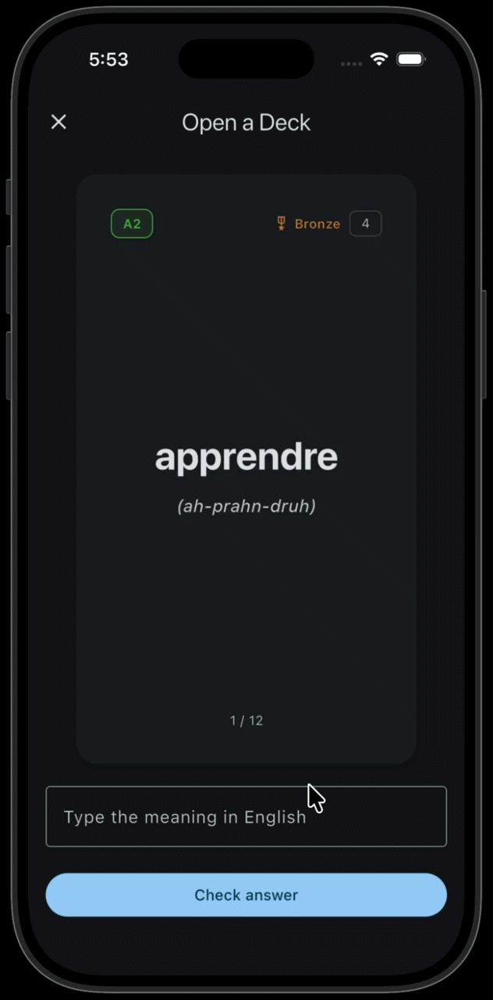
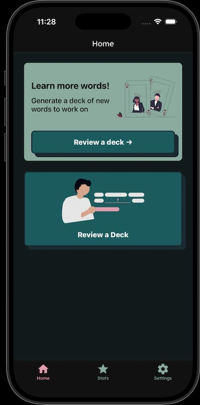

# Allô Cartô (WIP)

Allô Carto was made to drill words into your brain with flashcard quizzes, games, and exercises until you actually know them.

When learning another language, tracking how many words you know matters. Like a lot. You need to learn multiple words every day, and you should know exactly how many you know.

