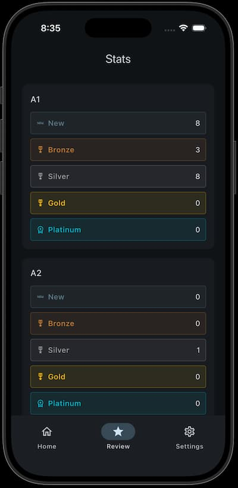

# Allô Cartô (WIP)

A flashcard language learning app made to help drill words into your brain with flashcards, games, and exercises.

The idea is to help users track how many new words they're learning a day and how well they know them.

