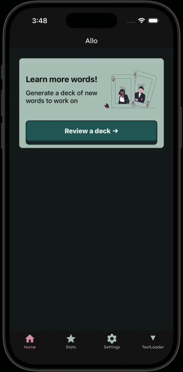

# Allô Carto

**_Work in progress!_**

## Dev Notes

- May 15, 2026 | Started rebuilding in React Native. I preserved the flutter version under branch `v1-flutter`.

## Style Guide

### Colors

#### Dark

- Primary : `#1C5B5E`

- Secondary : `#762D3D`

- Text : `#121212`

- Background : `#131A1B`

- Border : `#1B2B31`

- Secondary Border : `#382326`

#### Light

- Primary: `#7BADA6`

- Secondary: `#E09FAD`

- Text: `#F7F7F7`

- Background: `#8CABA0`

- Border: `#465B5D`

- Secondary Border: `#6B474B`

### Alerts

#### Dark

- Success: #032B1C

- Warning: #332105

- Danger: #3E0E14

#### Light

- Success: #DDFFD6

- Warning: #FFC670

- Danger: #FF7081

### Fonts

**Lexend** is used throughout the application. The font is included in `app/assets/fonts/lexend-variable.ttf` and loaded asychonously via the `useFonts` hook via expo.

https://blog.logrocket.com/how-to-add-custom-fonts-react-native/

## Roadmap

- DB sqlite? Nous besoin quelque chose sur le frontend. Ce sera cree avec decks premiere et les words apre.
- Rarate et styles des cartes. Les cartes plus rares ont des styles plus cool.
- Idea pour deck du rare, quand un personne besoin mots nouveaux, cest bonne pour mots le personne ne trouve pa

## TODO

Real quick so I don't forget...

- Style the choosedeck page
- testing lib
