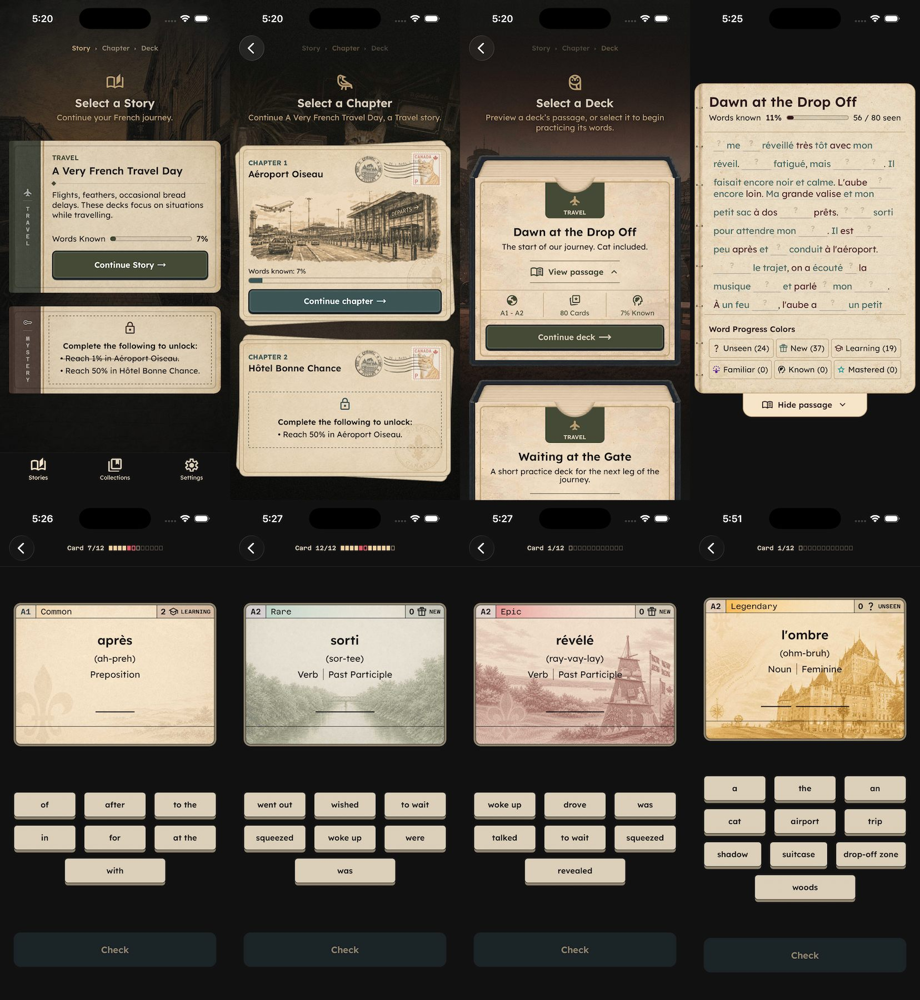

# Allô Carto

Allô Carto is a flashcard app I’m building to help people (including me) learn Québec French through stories. The other language apps had a hard time keeping my attention so I started building my own.

The basic idea is that instead of studying a bunch of completely disconnected things, the cards in Allô Carto are tied to stories. You can read through a story without knowing everything, study the decks associated with it, and then come back and understand more of what you read. The better you know the vocabulary, the more the story starts to make sense.

It's still very much a work in progress. Eventually I'd like to polish it up and put it on the App Store, but for now I'm mostly just having fun building the thing.

## Built with

- [Expo](https://expo.dev/) and [React Native](https://reactnative.dev/)
- TypeScript and Expo Router
- SQLite for on-device vocabulary and progress data
- Jest and React Native Testing Library for tests

## Roadmap

- Collections and collectible cards
- Unlockables and achievements
- More ways to study a deck, including reverse and english-to-french multiple choice modes. Also prestiging a mastered word is on the list
- I will be adding history focused content, especially history related stuff

## A note about AI

AI has been used in a few parts of the project. Some of my own photographs were transformed into stylized artwork with AI tools, and copilot helped with portions of the backend data stuff and for writing tests and a lot of the refactoring.

## Pronunciation notes

The pronunciation guides are intentionally informal approximations rather than official phonetic transcriptions:

- `an` / `en`: `ahn`
- `on`: `ohn`
- `in` / `ain` / `ein`: `an`
- `un`: `uhn`

The final `n` is generally there to suggest a French nasal sound. It is included often because these guides favor being approachable over being linguistically exact.

## Fonts

**Lexend** is used throughout the application, with **Azeret Mono** for compact rank/CEFR labels. Static font weights live in `src/app/assets/fonts/` and are loaded asynchronously via the `useFonts` hook in Expo.

[Adding custom fonts in React Native](https://blog.logrocket.com/how-to-add-custom-fonts-react-native/)
